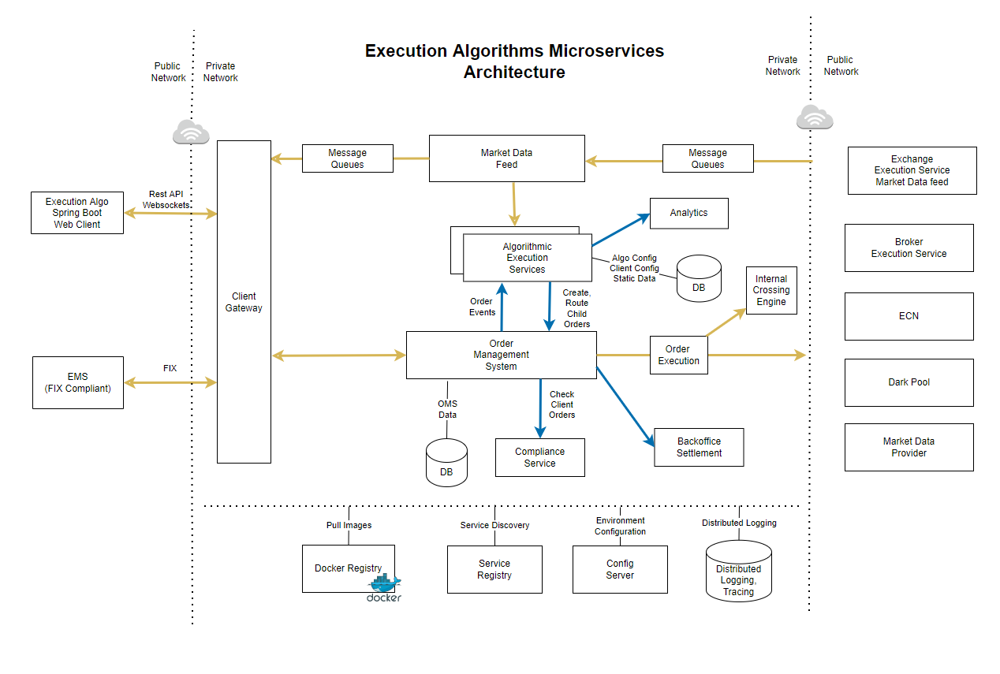
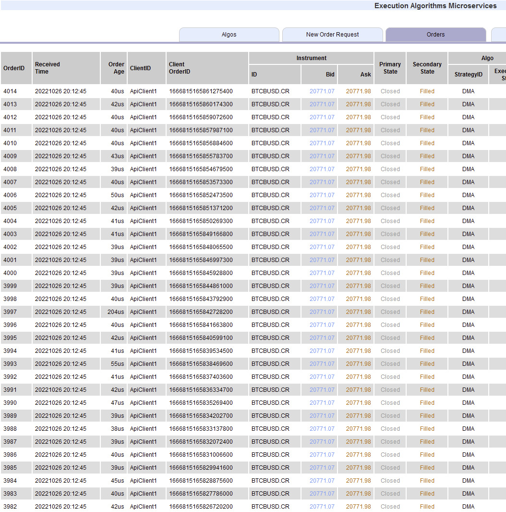
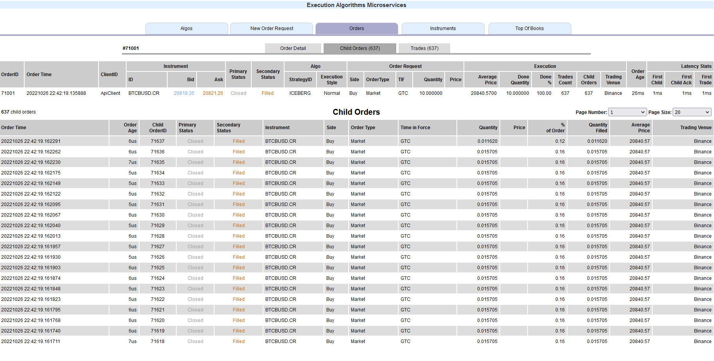

# Spring Boot Execution Algorithms Web Client

This project is a web interface to the Execution Algorithms Microservices

It demonstrate how to connect to the microservices

#### Main features:
- Web Client to place new algo orders and view the orders
- View Algorithm definitions provided by the microservices
- View tradeable instrument data
- View live market data
- Place new algo order requests;
- View orders
- Monitor the orders as the algo is working it
- Cancel open orders
- All timestamps are in epoch Nanos; and represented in a long format
- Ultra low latency architecture with nanosecond accuracy
  - Algo order like SOR, DMA, PEG, SNIPER, executes in 40 us on average (round trip)
  - Exchange simulator matches an order in 4 us on average

#### Algorithms
Variety of fully working algorithms are demonstrated in this project:

[ARRIVAL strategy](docs/ARRIVAL-strategy.md)

[ARRIVAL_IOC strategy](docs/ARRIVAL_IOC-strategy.md)

[DARK strategy](docs/DARK-strategy.md)

[DMA strategy](docs/DMA-strategy.md)

[FIX strategy](docs/FIX-strategy.md)

[ICEBERG strategy](docs/ICEBERG-strategy.md)

[PEG strategy](docs/PEG-strategy.md)

[PARTICIPATE strategy](docs/PARTICIPATE-strategy.md)

[SNIPER strategy](docs/SNIPER-strategy.md)

[STEALTH strategy](docs/STEALTH-strategy.md)

[SOR strategy](docs/SOR-strategy.md)

[STOP strategy](docs/STOP-strategy.md)

[TRAILING STOP strategy](docs/TRAILING_STOP-strategy.md)

[TWAP strategy](docs/TWAP-strategy.md) 

[VWAP strategy](docs/VWAP-strategy.md)

The full list of algos, strategy detail, strategy parameters, strategy objective, and usage
are available via Rest API.

You can view a working example here:
[http://liquidalpha.mywire.org:8080/algos.jsp](http://liquidalpha.mywire.org:8080/algos.jsp)

Note: If you have a suggestion for an algorithm; send it through and I will implement it as soon as I can

#### Markets
- The algos can work any tradeable market; such as Equities, Forex, Crypto, and Futures
- In this example; we are using Crypto markets as the historical market data, and live feeds are freely available
- Originally these algos were developed for Equities and Forex; and recently I added support for Cryptos

#### Architecture
- Spring Boot framework for the execution client webpage
- Rest API client for: Algorithm definitions, Instrument Data, Orders, Trades
- WebSockets for: Top Of book feed, Order Book feed, and Order and Trade feed
- Uses html5, javascript and jsp to render the pages
- Uses Jackson RestAPI client
- Reactive programming architecture
- Vert.x pattern in implementing algo strategies
- Concurrent / Multi-threading environment
- Zero Garbage Collection environment
- Disruptor Pattern in object pooling

#### Docker
- The algo web client is dockerrized. You can download a copy from docker and run it

#### Running Instance
This application is running at this URL:

[http://liquidalpha.mywire.org:8080](http://liquidalpha.mywire.org:8080)

You are welcome to test it out:

##### Contacts
If you have any queries, suggestions, clarifications, or technical question on on this project;
please contact me here in github or in my linkedin.

If you have a suggestion for an algorithm; send it through and I will implement it as soon as I can

All the best!

# Execution Algorithms Microservices

## Description
- Execution Algorithms on Crypto markets
- Microservices architecture
- Order Management System Microservice
- Market Data Microservice
- Algorithmic Execution Microservice
- Rest API
- WebSockets API
- FIX Protocol 
- Client Interface using Spring Boot with Rest API
- Message Queues
- MySQL Database

## Low Latency Architecture
Ultra low latency execution; on average; an SOR or DMA order is executed (round trip) in 40 us

### Orders Latency

Average execution time for an Algo order: 40 micro second

### Child Orders Latency

Average execution time for a child order on the simulated exchange: 7 us

## Deployments
- Docker
- Kubernetes

### Docker
This application is dockerized with Dockerfile

To build docker:

- docker build --tag execution-algo-client:1.0 .

### Docker Hub image

Latest docker image is available at my dockerhub; built with jdk17, running on port 9080

[hub.docker.com/r/ismailfer/execution-algo-client](https://hub.docker.com/r/ismailfer/execution-algo-client)

