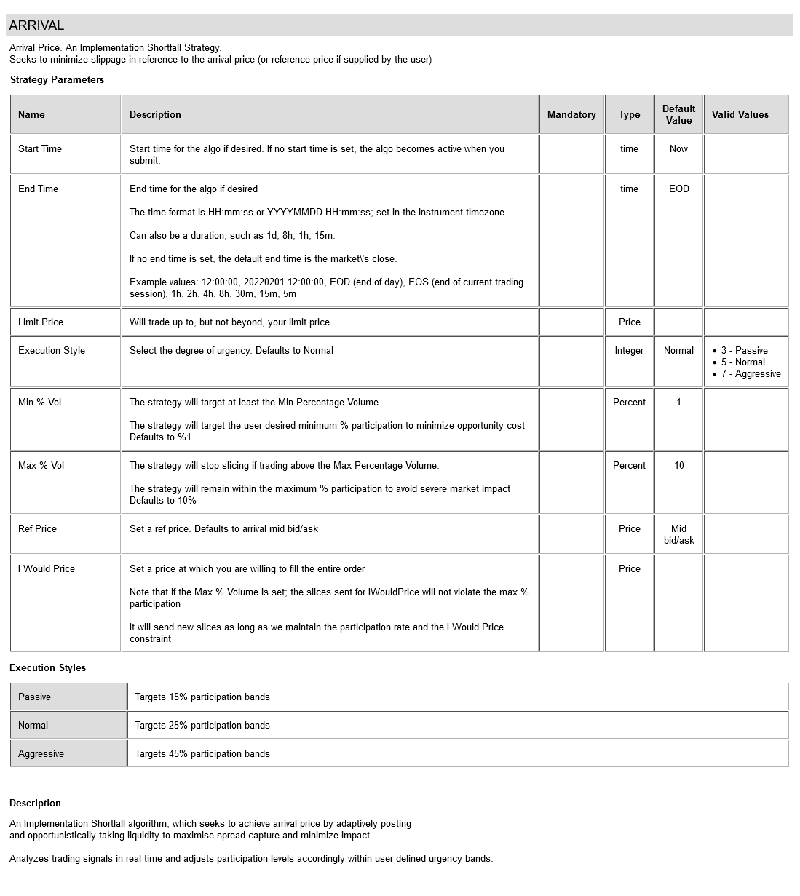

# ARRIVAL Strategy

Arrival Price. An Implementation Shortfall Strategy.
Seeks to minimize slippage in reference to the arrival price (or reference price if supplied by the user) 

#### Strategy Detail

##### Note
To view up-to-date information about this strategy; and other strategies; visit this website:

[http://liquidalpha.mywire.org:8080/algos.jsp](http://liquidalpha.mywire.org:8080/algos.jsp)

