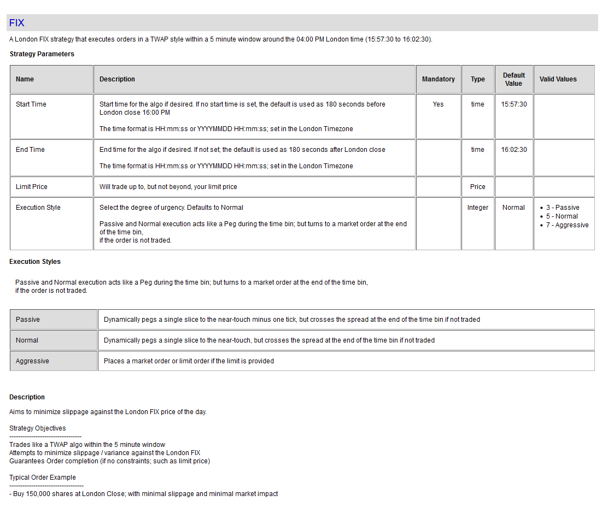

# FIX Strategy

A London FIX strategy that executes orders in a TWAP style within a 5 minute window around the 04:00 PM London time (15:57:30 to 16:02:30). 

#### Strategy Detail

##### Note
To view up-to-date information about this strategy; and other strategies; visit this website:

[http://liquidalpha.mywire.org:8080/algos.jsp](http://liquidalpha.mywire.org:8080/algos.jsp)

