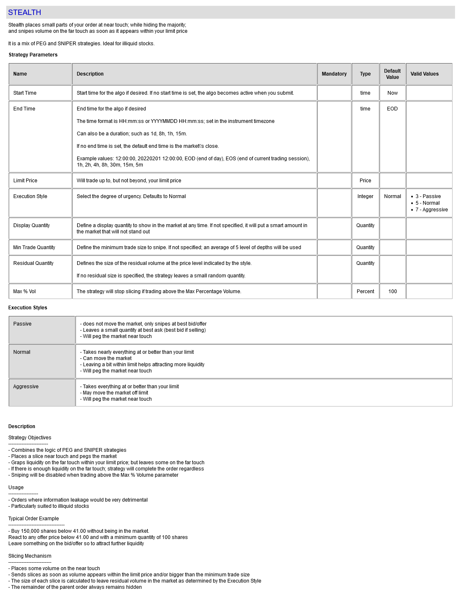

# STEALTH Strategy

Stealth places small parts of your order at near touch; while hiding the majority;
and snipes volume on the far touch as soon as it appears within your limit price

It is a mix of PEG and SNIPER strategies. Ideal for illiquid stocks. 

#### Strategy Detail

##### Note
To view up-to-date information about this strategy; and other strategies; visit this website:

[http://liquidalpha.mywire.org:8080/algos.jsp](http://liquidalpha.mywire.org:8080/algos.jsp)

