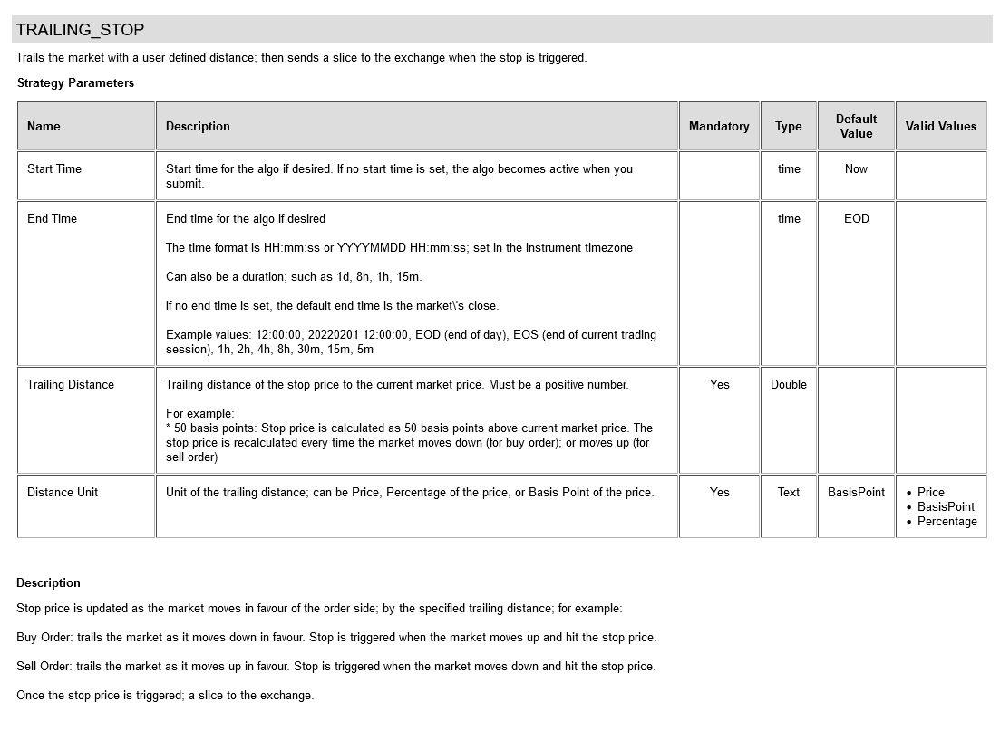

# TRAILING STOP Strategy

Trails the market with a user defined distance; then sends a slice to the exchange when the stop is triggered. 

#### Strategy Detail

##### Note
To view up-to-date information about this strategy; and other strategies; visit this website:

[http://liquidalpha.mywire.org:8080/algos.jsp](http://liquidalpha.mywire.org:8080/algos.jsp)

