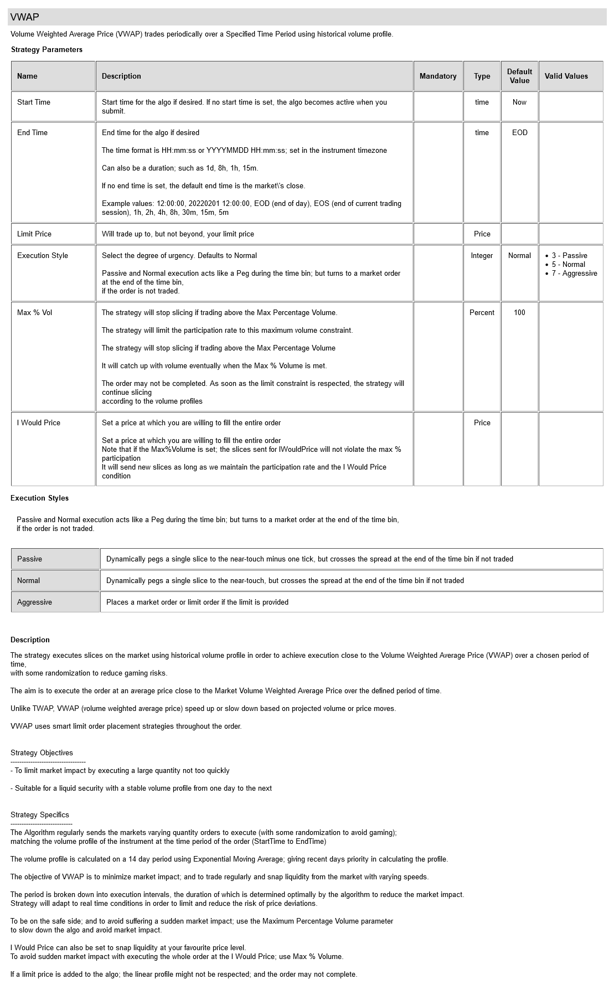

# VWAP Strategy

Volume Weighted Average Price (VWAP) trades periodically over a Specified Time Period using historical volume profile. 

#### Strategy Detail

##### Note
To view up-to-date information about this strategy; and other strategies; visit this website:

[http://liquidalpha.mywire.org:8080/algos.jsp](http://liquidalpha.mywire.org:8080/algos.jsp)

